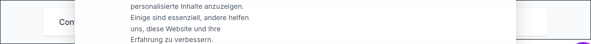

# Container Component



## Overview

A responsive container component to bound content width centrally.

## Props

- `size`: (Optional) Max width: `'sm' | 'md' | 'lg' | 'xl' | 'full'`. Defaults to `'lg'`.
- `as`: (Optional) The underlying element to render (e.g., `'div'`, `'section'`, `'main'`). Defaults to `'div'`.

## Usage Examples

### 1. Default Container

```tsx
import { Container } from '@/components/ui/container';

export function Example1() {
  return (
    <Container>
      <p>Content bound to lg size.</p>
    </Container>
  );
}
```

### 2. Semantic Main Container

```tsx
import { Container } from '@/components/ui/container';

export function Example2() {
  return (
    <Container as="main" size="xl">
      <h1>Main Content Area</h1>
      <p>Uses an extra-large max-width.</p>
    </Container>
  );
}
```

### 3. Small Article Container

```tsx
import { Container } from '@/components/ui/container';

export function Example3() {
  return (
    <Container as="article" size="sm">
      <h2>Blog Post Title</h2>
      <p>Narrow reading width for better typography.</p>
    </Container>
  );
}
```
