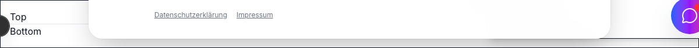

# Divider Component



## Overview

A divider component to separate content visually and semantically.

## Props

- `orientation`: (Optional) `'horizontal' | 'vertical'`. Defaults to `'horizontal'`.
- `decorative`: (Optional) Boolean. If true, it is hidden from assistive technologies using `role="none"` and `aria-hidden="true"`. Defaults to `false`.

## Usage Examples

### 1. Basic Horizontal Divider

```tsx
import { Divider } from '@/components/ui/divider';

export function Example1() {
  return (
    <div>
      <p>Section 1</p>
      <Divider />
      <p>Section 2</p>
    </div>
  );
}
```

### 2. Vertical Decorative Divider

```tsx
import { Divider } from '@/components/ui/divider';

export function Example2() {
  return (
    <div className="flex items-center h-8 gap-4">
      <span>Left</span>
      <Divider orientation="vertical" decorative />
      <span>Right</span>
    </div>
  );
}
```

### 3. Styled Divider

```tsx
import { Divider } from '@/components/ui/divider';

export function Example3() {
  return (
    <div>
      <p>Top</p>
      <Divider className="my-8 bg-blue-500 opacity-50" />
      <p>Bottom</p>
    </div>
  );
}
```
