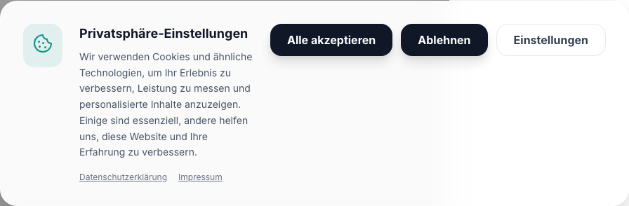

# Drawer Component Documentation



The Drawer component slides in from the edge of the screen. It's often used for navigation or filtering interfaces on mobile devices.

## Accessibility

- Focus is trapped within the drawer.
- Background scrolling is disabled with layout shift prevention.
- Can be dismissed using the `Escape` key.
- ARIA roles (`dialog`, `aria-modal`) are applied.

## Usage Examples

### 1. Right Side Drawer (Default)

```tsx
import { useState } from 'react';
import { Drawer } from '@/components/ui/drawer';
import { Button } from '@/components/ui/button';

export function RightDrawerExample() {
  const [isOpen, setIsOpen] = useState(false);

  return (
    <>
      <Button onClick={() => setIsOpen(true)}>Open Right Drawer</Button>
      <Drawer isOpen={isOpen} onClose={() => setIsOpen(false)} title="Filters">
        <p className="text-gray-600">Filter options go here.</p>
      </Drawer>
    </>
  );
}
```

### 2. Left Navigation Drawer

```tsx
import { useState } from 'react';
import { Drawer } from '@/components/ui/drawer';
import { Button } from '@/components/ui/button';

export function LeftDrawerExample() {
  const [isOpen, setIsOpen] = useState(false);

  return (
    <>
      <Button variant="outline" onClick={() => setIsOpen(true)}>
        Menu
      </Button>
      <Drawer isOpen={isOpen} onClose={() => setIsOpen(false)} position="left" title="Navigation">
        <ul className="space-y-2 mt-4">
          <li>
            <a href="#" className="block p-2 hover:bg-gray-100 rounded-md">
              Home
            </a>
          </li>
          <li>
            <a href="#" className="block p-2 hover:bg-gray-100 rounded-md">
              About
            </a>
          </li>
          <li>
            <a href="#" className="block p-2 hover:bg-gray-100 rounded-md">
              Contact
            </a>
          </li>
        </ul>
      </Drawer>
    </>
  );
}
```

### 3. Bottom Action Sheet

```tsx
import { useState } from 'react';
import { Drawer } from '@/components/ui/drawer';
import { Button } from '@/components/ui/button';

export function BottomDrawerExample() {
  const [isOpen, setIsOpen] = useState(false);

  return (
    <>
      <Button onClick={() => setIsOpen(true)}>More Actions</Button>
      <Drawer
        isOpen={isOpen}
        onClose={() => setIsOpen(false)}
        position="bottom"
        title="Actions"
        hideCloseButton
      >
        <div className="flex flex-col gap-2 mt-4">
          <Button variant="ghost" className="w-full justify-start">
            Share
          </Button>
          <Button variant="ghost" className="w-full justify-start">
            Copy Link
          </Button>
          <Button
            variant="ghost"
            className="w-full justify-start text-red-600 hover:text-red-700 hover:bg-red-50"
          >
            Report
          </Button>
        </div>
      </Drawer>
    </>
  );
}
```
