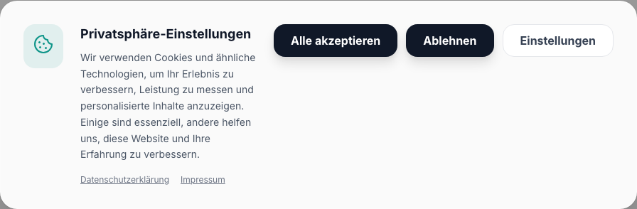

# Modal Component Documentation



The Modal component is an overlay that prevents interaction with the rest of the page until dismissed. It includes strict focus trapping, scroll locking, and escape key dismissal for accessibility, and it follows the `emil-design-eng` animation standards.

## Accessibility

- Focus is trapped within the modal when open.
- Background scrolling is disabled with layout shift prevention.
- Can be dismissed using the `Escape` key.
- ARIA roles (`dialog`, `aria-modal`) are correctly applied.

## Usage Examples

### 1. Basic Modal

```tsx
import { useState } from 'react';
import { Modal } from '@/components/ui/modal';
import { Button } from '@/components/ui/button';

export function BasicModalExample() {
  const [isOpen, setIsOpen] = useState(false);

  return (
    <>
      <Button onClick={() => setIsOpen(true)}>Open Modal</Button>
      <Modal isOpen={isOpen} onClose={() => setIsOpen(false)} title="Basic Modal">
        <p className="text-gray-600">This is a basic modal content.</p>
        <div className="mt-6 flex justify-end">
          <Button onClick={() => setIsOpen(false)}>Close</Button>
        </div>
      </Modal>
    </>
  );
}
```

### 2. Destructive Action Modal

```tsx
import { useState } from 'react';
import { Modal } from '@/components/ui/modal';
import { Button } from '@/components/ui/button';

export function DestructiveModalExample() {
  const [isOpen, setIsOpen] = useState(false);

  return (
    <>
      <Button variant="outline" onClick={() => setIsOpen(true)}>
        Delete Item
      </Button>
      <Modal isOpen={isOpen} onClose={() => setIsOpen(false)} title="Are you sure?">
        <p className="text-gray-600">
          This action cannot be undone. This will permanently delete the item.
        </p>
        <div className="mt-6 flex justify-end gap-3">
          <Button variant="ghost" onClick={() => setIsOpen(false)}>
            Cancel
          </Button>
          <Button
            variant="primary"
            className="bg-red-600 hover:bg-red-700"
            onClick={() => setIsOpen(false)}
          >
            Delete
          </Button>
        </div>
      </Modal>
    </>
  );
}
```

### 3. Form Modal without Close Icon

```tsx
import { useState } from 'react';
import { Modal } from '@/components/ui/modal';
import { Button } from '@/components/ui/button';
import { Input } from '@/components/ui/input';

export function FormModalExample() {
  const [isOpen, setIsOpen] = useState(false);

  return (
    <>
      <Button onClick={() => setIsOpen(true)}>Edit Profile</Button>
      <Modal isOpen={isOpen} onClose={() => setIsOpen(false)} title="Edit Profile" hideCloseButton>
        <form
          className="space-y-4 mt-4"
          onSubmit={(e) => {
            e.preventDefault();
            setIsOpen(false);
          }}
        >
          <Input label="Name" placeholder="John Doe" />
          <Input label="Email" type="email" placeholder="john@example.com" />
          <div className="mt-6 flex justify-end gap-3">
            <Button type="button" variant="ghost" onClick={() => setIsOpen(false)}>
              Cancel
            </Button>
            <Button type="submit">Save Changes</Button>
          </div>
        </form>
      </Modal>
    </>
  );
}
```
