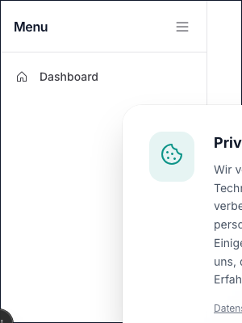

# Sidebar Component



## TypeScript Props

```ts
export interface SidebarItem {
  id: string;
  label: string;
  href?: string;
  icon?: React.ReactNode;
  subItems?: { label: string; href: string }[];
}

export interface SidebarProps extends React.HTMLAttributes<HTMLElement> {
  items: SidebarItem[];
  defaultCollapsed?: boolean;
}
```

## ARIA Rationale

- `aria-label="Sidebar Navigation"`: Labels the `nav` landmark specifically for the sidebar to differentiate it from other nav elements.
- `aria-expanded`: Used on collapsible sub-menus to indicate whether they are open.
- `tabIndex={0}` and `aria-hidden`: Applied to sub-menu links. When a sub-menu is collapsed (via CSS grid `0fr`), its children receive `tabIndex={-1}` and `aria-hidden="true"` so they are properly removed from the focus order and screen reader flow.
- `aria-label="Expand sidebar"` / `"Collapse sidebar"`: Dynamically updates on the toggle button based on the sidebar's collapsed state.

## Usage Examples

### 1. Basic Links

```tsx
import { Sidebar } from '@/components/layout/sidebar';
import { House, Gear } from '@phosphor-icons/react/dist/ssr';

export default function Example() {
  const items = [
    { id: 'home', label: 'Home', href: '/', icon: <House /> },
    { id: 'settings', label: 'Settings', href: '/settings', icon: <Gear /> },
  ];
  return <Sidebar items={items} />;
}
```

### 2. Nested Sub-Menus

```tsx
import { Sidebar } from '@/components/layout/sidebar';
import { ChartBar, Users } from '@phosphor-icons/react/dist/ssr';

export default function Example() {
  const items = [
    {
      id: 'analytics',
      label: 'Analytics',
      icon: <ChartBar />,
      subItems: [
        { label: 'Overview', href: '/analytics/overview' },
        { label: 'Reports', href: '/analytics/reports' },
      ],
    },
    {
      id: 'team',
      label: 'Team',
      href: '/team',
      icon: <Users />,
    },
  ];
  return <Sidebar items={items} />;
}
```

### 3. Default Collapsed

```tsx
import { Sidebar } from '@/components/layout/sidebar';
import { Storefront } from '@phosphor-icons/react/dist/ssr';

export default function Example() {
  const items = [{ id: 'store', label: 'Store', href: '/store', icon: <Storefront /> }];
  return <Sidebar items={items} defaultCollapsed={true} />;
}
```
