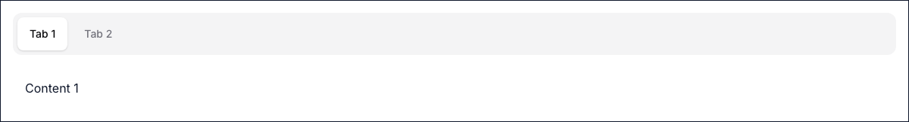

# Tabs Component



## TypeScript Props

```ts
export interface Tab {
  id: string;
  label: React.ReactNode;
  content: React.ReactNode;
}

export interface TabsProps extends Omit<React.HTMLAttributes<HTMLDivElement>, 'onChange'> {
  tabs: Tab[];
  defaultValue?: string;
  onChange?: (id: string) => void;
}
```

## ARIA Rationale

- `role="tablist"`, `role="tab"`, `role="tabpanel"`: Defines the semantic relationships between the tab container, individual tabs, and their corresponding content panels.
- `aria-selected`: Indicates which tab is currently active.
- `aria-controls` & `aria-labelledby`: Creates a programmatically determinable relationship between a tab and its panel.
- **Roving Tabindex**: Only the active tab receives `tabIndex={0}`. Inactive tabs receive `tabIndex={-1}`. Keyboard navigation uses `ArrowLeft`, `ArrowRight`, `Home`, and `End` to move focus, adhering to W3C ARIA Authoring Practices.

## Usage Examples

### 1. Basic Text Tabs

```tsx
import { Tabs } from '@/components/ui/tabs';

export default function Example() {
  const tabs = [
    { id: 'account', label: 'Account', content: <div>Account Settings</div> },
    { id: 'password', label: 'Password', content: <div>Password Settings</div> },
  ];
  return <Tabs tabs={tabs} defaultValue="account" />;
}
```

### 2. Controlled State with onChange

```tsx
'use client';
import { useState } from 'react';
import { Tabs } from '@/components/ui/tabs';

export default function Example() {
  const [active, setActive] = useState('billing');
  const tabs = [
    { id: 'profile', label: 'Profile', content: <p>Profile details</p> },
    { id: 'billing', label: 'Billing', content: <p>Billing information</p> },
  ];

  return (
    <div>
      <p>Currently viewing: {active}</p>
      <Tabs tabs={tabs} defaultValue="billing" onChange={setActive} />
    </div>
  );
}
```

### 3. Tabs with Icons

```tsx
import { Tabs } from '@/components/ui/tabs';
import { User, Bell } from '@phosphor-icons/react/dist/ssr';

export default function Example() {
  const tabs = [
    {
      id: 'user',
      label: (
        <div className="flex items-center gap-2">
          <User /> User
        </div>
      ),
      content: <p>User content</p>,
    },
    {
      id: 'notifications',
      label: (
        <div className="flex items-center gap-2">
          <Bell /> Alerts
        </div>
      ),
      content: <p>Notification content</p>,
    },
  ];
  return <Tabs tabs={tabs} />;
}
```
