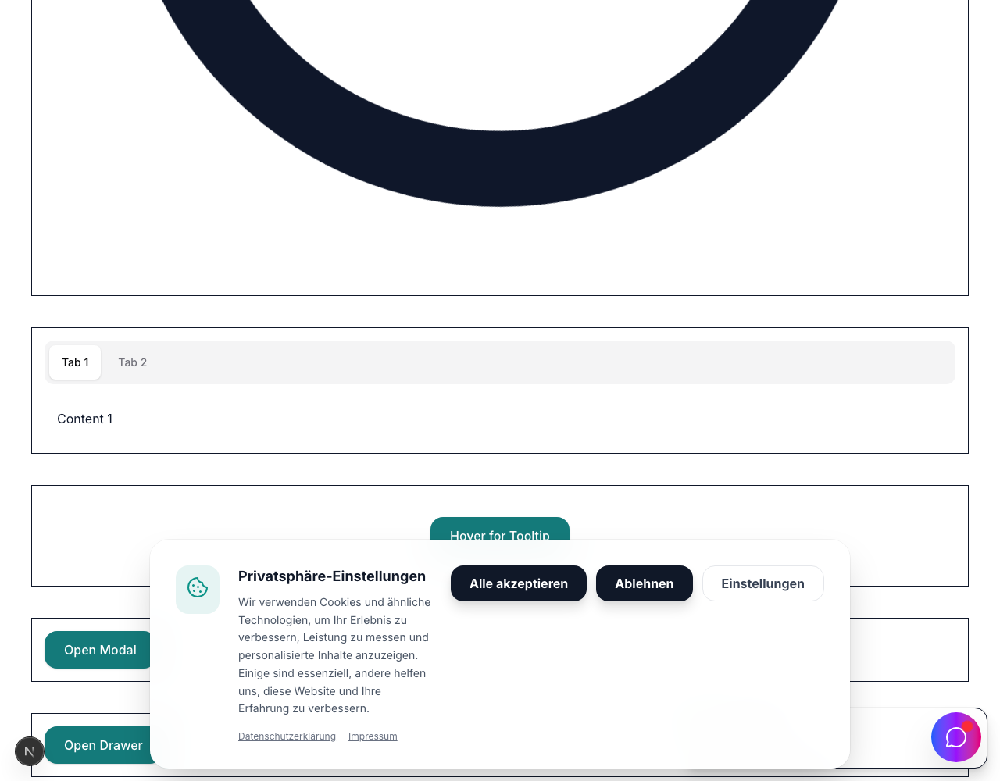

# Toast Component Documentation



The Toast component provides non-interruptive notifications. It uses a zustand store for state management and Framer Motion's layout animations for smooth repositioning.

## Setup

Ensure `<Toaster />` is rendered at the root of your application (usually inside `app/layout.tsx`).

## Usage Examples

### 1. Basic Success Toast

```tsx
import { toast } from '@/hooks/use-toast';
import { Button } from '@/components/ui/button';

export function SuccessToastExample() {
  return (
    <Button
      onClick={() => {
        toast({
          title: 'Profile updated',
          description: 'Your changes have been saved successfully.',
          type: 'success',
        });
      }}
    >
      Save Changes
    </Button>
  );
}
```

### 2. Error Toast with Action

```tsx
import { toast } from '@/hooks/use-toast';
import { Button } from '@/components/ui/button';

export function ErrorToastExample() {
  return (
    <Button
      variant="outline"
      onClick={() => {
        toast({
          title: 'Upload failed',
          description: 'The file you selected is too large. Please choose a file smaller than 5MB.',
          type: 'error',
          duration: 6000,
        });
      }}
    >
      Upload File
    </Button>
  );
}
```

### 3. Info Toast (Persistent)

```tsx
import { toast } from '@/hooks/use-toast';
import { Button } from '@/components/ui/button';

export function InfoToastExample() {
  return (
    <Button
      variant="ghost"
      onClick={() => {
        toast({
          title: 'New version available',
          description: 'Refresh the page to get the latest features.',
          type: 'info',
          duration: Infinity, // Requires manual dismissal
        });
      }}
    >
      Check for Updates
    </Button>
  );
}
```
