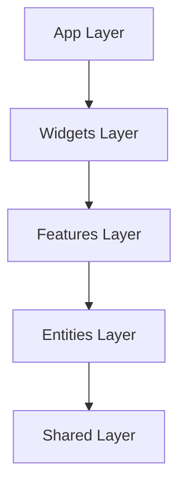

# ⚡️ CODAY | The "Market Eater"


<p align="center">
  <strong>High-Performance. Anti-AI Aesthetic. Pure Domination.</strong><br>
  Built for agencies that refuse to be average.
</p>

---

## 💎 Manifesto

**Coday** is a conversion weapon. It rejects the sterile, generic "SaaS" look in favor of a **visceral, high-voltage aesthetic**.

- **Radical Transparency:** Calculators and real data over marketing fluff.
- **Visceral Interactions:** Every click feels physical.
- **Speed as a Feature:** Sub-second load times are the baseline.

---

## 🏗 System Architecture (FSD)

We utilize **Feature-Sliced Design (FSD)** to ensure maintainability at scale.



### 📂 Directory Structure

| Layer        | Path            | Purpose                                                 |
| :----------- | :-------------- | :------------------------------------------------------ |
| **App**      | `src/App.tsx`   | Global providers, routing, and entry logic.             |
| **Pages**    | `src/pages/`    | Composition of widgets to form routes (Home, Services). |
| **Widgets**  | `src/widgets/`  | Self-contained big UI blocks (`CardNav`, `Footer`).     |
| **Features** | `src/features/` | User interactions (`Calculator`, `ContactForm`).        |
| **Entities** | `src/entities/` | Business models (`BlogPost`, `ServiceCard`).            |
| **Shared**   | `src/shared/`   | Reusable primitives (`Button`, `Icon`) and utils.       |

---

## ⚡️ Tech Stack

### Core

- **Framework:** `React 19` + `Vite 6` (Build tool)
- **Language:** `TypeScript 5.8` (Strict Mode)
- **Styling:** `Tailwind CSS 4` + `CSS Modules` (CardNav)
- **State:** `Zustand 5` (Global Store) + `React Context`

### Backend & Integrations

- **Database:** `Supabase` (PostgreSQL)
- **Email:** `Resend` (Transactional Emails)
- **Maps:** `Google Maps API` (Custom Dark Theme)
- **CMS (Blog):** `MDX` (Markdown with React Components)

---

## 💻 Setup Guide

### 1. Prerequisites

- Node.js v20+
- npm or pnpm

### 2. Installation

```bash
git clone https://github.com/umutcantezgel-cpu/Coday.git
cd Coday
npm install
```

### 3. Environment Variables

Create `.env.local`:

```env
# Supabase (Database & Auth)
VITE_SUPABASE_URL=your_project_url
VITE_SUPABASE_ANON_KEY=your_anon_key

# Google Maps (Contact Page)
VITE_GOOGLE_MAPS_API_KEY=your_maps_key

# Resend (Email)
VITE_RESEND_API_KEY=your_resend_key
```

### 4. Run Development Server

```bash
npm run dev
# Server starts at http://localhost:4173
```

---

## 🚀 Deployment (Vercel)

This project is optimized for **Vercel**.

1.  **Connect Repo:** Import the GitHub repository to Vercel.
2.  **Build Settings:**
    - Framework Preset: `Vite`
    - Build Command: `npm run build`
    - Output Directory: `dist`
3.  **Environment Variables:** Copy all vars from `.env.local` to Vercel Project Settings.
4.  **Deploy:** Click "Deploy".

### Post-Deployment Verification

After deploying, always check:

- [ ] **Icons:** Ensure no missing icons (check console for 404s).
- [ ] **Navigation:** Verify the "Dynamic Island" expands/collapses smoothly.
- [ ] **Forms:** Test the Contact Form submission (check Resend logs).

---

## 🎨 Design System: "Aurora"

- **Primary Color:** Deep Teal `#147a7a`
- **Surface:** Glassmorphism (`backdrop-filter: blur(20px)`)
- **Typography:** `Outfit` (Headings) + `Inter` (Body)

---

<p align="center">
  Built with ❤️ & ⚡️ by <strong>Agency Domination Team</strong>.
</p>
