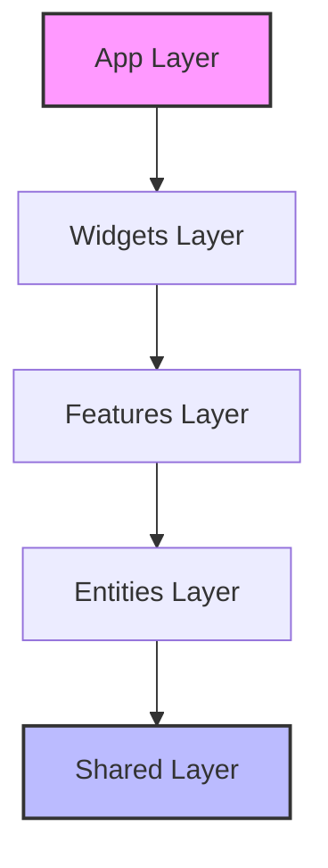

<div align="center">

# ⚡️ AGENCY DOMINATION
### "The Market Eater"


<p align="center">
  <strong>High-Performance. Anti-AI Aesthetic. Pure Domination.</strong><br>
  Built for agencies that refuse to be average.
</p>

[Explore Demo](https://agency-domination.vercel.app) · [Report Bug](https://github.com/umutcantezgel-cpu/agency-domination/issues) · [Request Feature](https://github.com/umutcantezgel-cpu/agency-domination/issues)

</div>

---

## 💎 The Vision (Manifesto)

**Agency Domination** is not just a template; it is a **conversion weapon**. Designed with the "Anti-AI" aesthetic, it rejects the sterile, generic look of modern SaaS in favor of **human-centric, high-voltage design**.

We believe in:
1.  **Visceral Interactions:** Every click should feel physical.
2.  **Radical Transparency:** Calculators, Simulators, and Real Data over marketing fluff.
3.  **Speed as a Feature:** Sub-second load times are the baseline, not the goal.

This project implements the **Aurora Design Protocol**, utilizing deep sapphire blues, vibrant violets, and glassmorphism to create a premium, enterprise-grade feel.

---

## 🏗 System Architecture

We utilize **Feature-Sliced Design (FSD)** to ensure maintainability at scale. This architecture prevents "spaghetti code" by enforcing strict dependency rules.

### Layer Hierarchy (Top-Down)



| Layer | Description | Examples |
|-------|-------------|----------|
| **📂 App** | Global entry points, providers, routers, and styles. | `main.tsx`, `App.tsx`, `index.css` |
| **📂 Pages** | Composition of widgets to form full routes. | `Home.tsx`, `Services.tsx` |
| **📂 Widgets** | Self-contained UI blocks (business logic + UI). | `ChatWidget`, `Newsletter`, `Header` |
| **📂 Features** | User interactions that bring value. | `ROICalculator`, `HackSimulator`, `ThemeSwitcher` |
| **📂 Entities** | Business domain models and data display. | `UserCard`, `BlogPost`, `ServiceCard` |
| **📂 Shared** | Reusable primitives, UI kit, libs, API. | `Button`, `Input`, `api/supabase` |

---

## ⚡️ Tech Stack (The Engine)

We rely on the bleeding edge of the React ecosystem to deliver maximum performance.

### 🎨 Frontend Core
*   **Framework:** `React 19` + `Vite 6` (Extreme speed)
*   **Language:** `TypeScript 5.8` (Strict Mode enabled)
*   **Styling:** `Tailwind CSS 4.0` (Zero-runtime CSS)
*   **Animation:** `Framer Motion 12` + `GSAP` (Cinema-grade motion)

### 🔌 Backend & Logic
*   **Database:** `Supabase` (PostgreSQL)
*   **State Management:** `Zustand 5` (Flux architecture, minimal boilerplate)
*   **Validation:** `Zod` (Schema-first data validation)
*   **Localization:** `i18next` (Enterprise-grade I18n)

### 🛠 Optimization & Ops
*   **Linter:** `ESLint` + `Prettier` (Strict stylistic rules)
*   **Build:** `Vite` (Rollup-based production builds)
*   **Icons:** `Material Symbols` + `Lucide React` (Ligature-optimized)

---

## 🚀 Key Features

### 1. The Magic Bento Grid
A fully responsive, masonry-style grid layout used in the **Services** section. It adapts column counts dynamically (1col mobile, 2col tablet, 4col desktop) and features hover-tilt effects.
*   **Location:** `src/components/shared/ui/MagicBento.tsx`

### 2. The Hack Simulator
An interactive terminal component that simulates a "WordPress vs. Custom Code" security audit. Real-time typing effects and state-dependent rendering.
*   **Location:** `src/features/blog/ui/interactive/HackSimulator.tsx`

### 3. ROI Calculator (Ecommerce)
A functional business logic component that projects revenue increase based on visitor counts and conversion rates. Uses `CountUp` for engaging number transitions.
*   **Location:** `src/pages/services/development/Ecommerce.tsx`

### 4. Global Mobile Optimization
*   **Touch Targets:** All interactive elements enforced to min 44px height.
*   **Thumb Zone:** Key CTAs placed in accessible areas.
*   **Feedback:** Global `active:scale-95` state for tactile feel.

---

## 💻 Getting Started

### Prerequisites
*   Node.js v20.10.0 or higher
*   pnpm (recommended) or npm

### Installation

1.  **Clone the Beast**
    ```bash
    git clone https://github.com/umutcantezgel-cpu/agency-domination.git
    cd agency-domination
    ```

2.  **Install Dependencies**
    ```bash
    npm install
    # or
    pnpm install
    ```

3.  **Environment Setup**
    Create a `.env.local` file:
    ```env
    VITE_SUPABASE_URL=your_supabase_url
    VITE_SUPABASE_ANON_KEY=your_supabase_anon_key
    ```

4.  **Ignite Logic**
    ```bash
    npm run dev
    ```

---

## 🎨 Design System: "Aurora"

Our design system is strictly enforced via Tailwind config and Utility classes.

### Color Palette
*   **Primary:** `var(--color-primary)` (Deep Teal: #147a7a)
*   **Secondary:** `var(--color-secondary)` (Navy Charcoal: #2D3748)
*   **Accent:** Gradients of Violet/Pink/Blue (`bg-gradient-ocean`)

### Typography
*   **Headlines:** `Outfit` (Bold, Modern, Geometric)
*   **Body:** `Inter` (Clean, Readable, Standard)

---

## 🤝 Contribution

1.  **Branch:** Create a feature branch (`git checkout -b feature/AmazingFeature`)
2.  **Commit:** Commit your changes (`git commit -m 'feat: Add AmazingFeature'`) - *Use Semantic Commits!*
3.  **Push:** Push to the branch (`git push origin feature/AmazingFeature`)
4.  **PR:** Open a Pull Request

---

<p align="center">
  Built with ❤️ & ⚡️ by <strong>Agency Domination Team</strong>.
</p>
