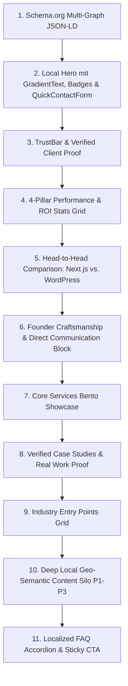

# Coday — Master Local SEO Prompt Pipeline & Execution Engine

## 1. Executive Summary & Architektur-Standard

Dieses Dokument definiert das **Master Prompt Framework** für die systematische Transformation aller lokalen Landingpages und regionalen Hubs von Coday (`codayweb.de`).

Jede lokale Seite wird nach dem **„Homepage-Paritäts-Prinzip“** aufgebaut: Anstelle von flachen, schematischen Textseiten erhält **jede einzelne Stadt, jeder Landkreis und jede lokale Branchen-Kombination** die volle architektonische Tiefe, visuelle Exzellenz und Conversion-Power der Coday-Startseite — individuell angereichert mit lokaler Wirtschafts-DNA, Gewerbegebieten, Verkehrsknotenpunkten (A45, A5, B49, ICE) und spezifischen regionalen B2B-Suchintentionen.

---

## 2. Der 11-Stufen Homepage-Paritäts-Standard

Jede Seite, die durch diese Pipeline generiert wird, implementiert zwingend folgende 11 Kernkomponenten:

### Die 11 Module im Detail:

1. **Schema.org Multi-Graph JSON-LD:** `LocalBusiness`, `ProfessionalService`, `BreadcrumbList`, `FAQPage`.
2. **Local Hero Section:**
   - City-fokussierte H1 mit dynamischem `GradientText`.
   - `ClientRotatingText` (Desktop) und `MobileRotatingText` (Mobil) für lokale USPs (z.B. `< 500ms Ladezeit`, `100% DSGVO-konform`, `100/100 Core Web Vitals`).
   - Integriertes, reaktives `QuickContactForm` für sofortige Lead-Generierung direkt above the fold.
3. **TrustBar / LogoLoop:** Echte, verifizierbare Kundenreferenzen (Batherm, MS Schlüsseldienst Wetzlar, Lindener Ratsstuben). Keine Fake-Logos.
4. **Stats Section:** 4 High-Impact Bento Stats Cards (`< 0.5s`, `100% Code-Eigentum`, `24h Support`, `+300% Conversion-Potenzial`).
5. **Agency Comparison Table:** Direkter technologischer und wirtschaftlicher Vergleich: Modernes Next.js (Coday) vs. Klassisches WordPress / Träge Agenturen.
6. **Philosophy Section:** „AI-augmented Craftsmanship“ – Direkte Zusammenarbeit mit Inhaber Umutcan Emre Tezgel ohne Projektmanager-Overhead und ohne Subunternehmer-Verzögerungen.
7. **Services Bento Showcase:** Webentwicklung, High-End Webdesign & UX, Technisches Silo-SEO, Headless CMS, E-Commerce.
8. **Portfolio Teaser Section:** Echte Fallstudien mit messbaren Metriken und Vorher-Nachher-Transparenz.
9. **Industries Grid:** Maßgeschneiderte Einstiegspunkte für Schlüsselbranchen der Region (Handwerk, Praxen/Medizin, Automobil, Industrie/B2B, Kanzleien, Immobilien).
10. **Geo-Semantischer Content-Block (P1–P3):** Fundierte Analysen der lokalen Wirtschaftskraft, Gewerbegebiete, Nachbarstädte und digitaler Wettbewerbsvorteile.
11. **Local FAQ Accordion & Sticky CTA:** 5–6 kaufentscheidende Fragen (Festpreis auf Anfrage, 2-Wochen-Lieferzeit, Google-Garantie) plus mobiler Sticky CTA.

---

## 3. Pipeline-Übersicht nach Clustern

Die vollständigen, sofort ausführbaren Prompts sind aufgeteilt in folgende Cluster-Dokumente:

| Cluster                                        | Datei                                                                                                                        | Enthaltene Standorte & Seiten                                                                                                                                                                                                               |
| :--------------------------------------------- | :--------------------------------------------------------------------------------------------------------------------------- | :------------------------------------------------------------------------------------------------------------------------------------------------------------------------------------------------------------------------------------------ |
| **Cluster 1: Mittelhessen & HQ**               | [`01_MITTELHESSEN_HQ_PROMPTS.md`](file:///Users/umurey/agency-domination/docs/prompts/01_MITTELHESSEN_HQ_PROMPTS.md)         | Wetzlar, Gießen, Marburg, Herborn, Dillenburg, Limburg a. d. Lahn, Weilburg a. d. Lahn                                                                                                                                                      |
| **Cluster 2: Rhein-Main & Taunus**             | [`02_RHEIN_MAIN_TAUNUS_PROMPTS.md`](file:///Users/umurey/agency-domination/docs/prompts/02_RHEIN_MAIN_TAUNUS_PROMPTS.md)     | Frankfurt, Wiesbaden, Bad Homburg, Oberursel, Bad Vilbel, Offenbach, Hanau, Hofheim, Rüsselsheim, Rodgau, Dietzenbach, Friedberg                                                                                                            |
| **Cluster 3: Süd-, Nord- & Osthessen**         | [`03_SUED_NORD_OSTHESSEN_PROMPTS.md`](file:///Users/umurey/agency-domination/docs/prompts/03_SUED_NORD_OSTHESSEN_PROMPTS.md) | Darmstadt, Bensheim, Kassel, Fulda                                                                                                                                                                                                          |
| **Cluster 4: 13 Hessische Landkreis-Hubs**     | [`04_LANDKREIS_HUBS_PROMPTS.md`](file:///Users/umurey/agency-domination/docs/prompts/04_LANDKREIS_HUBS_PROMPTS.md)           | Lahn-Dill-Kreis, Landkreis Gießen, Wetteraukreis, Hochtaunuskreis, Main-Taunus-Kreis, Kreis Offenbach, Main-Kinzig-Kreis, Marburg-Biedenkopf, Limburg-Weilburg, Rheingau-Taunus-Kreis, Darmstadt-Dieburg, Landkreis Fulda, Landkreis Kassel |
| **Cluster 5: Branchen & Spezial-Landingpages** | [`05_BRANCHEN_LOCAL_PROMPTS.md`](file:///Users/umurey/agency-domination/docs/prompts/05_BRANCHEN_LOCAL_PROMPTS.md)           | Hessen Master-Hub, Arzt Wetzlar, Arzt Gießen, Handwerker Wetzlar, KFZ-Werkstatt Hessen, KFZ-Mechatroniker Hessen, Autohändler Hessen, Next.js Migration                                                                                     |

---

## 4. Qualitäts- und Compliance-Regeln

Jede Umsetzung muss folgende harte Kriterien erfüllen:

- **Preisgestaltung:** Ausschließlich _"Verbindliches Festpreisangebot nach kostenloser Bedarfsanalyse"_ / _"Preise auf Anfrage"_. Im Vergleich zu traditionellen Großagenturen 5- bis 10-mal günstiger bei überlegener technischer Qualität (Next.js 15 vs. WordPress-Monolithen).
- **Inhaber & Vertrauen:** Coday ist die Solo-Agentur von Umutcan Emre Tezgel mit Sitz in Wetzlar. Keine erfundenen Teammitglieder oder Partnerschaften. Echte Referenzen (Batherm, MS Schlüsseldienst, Lindener Ratsstuben).
- **Performance-Garantie:** 100/100 Core Web Vitals, LCP < 0.5s, 0ms Cumulative Layout Shift, 100% Best Practices.
- **Verifikations-Pipeline:** Nach jeder Seiten-Implementierung müssen `npm run typecheck`, `npm run lint` und `npm run build` fehlerfrei durchlaufen.
